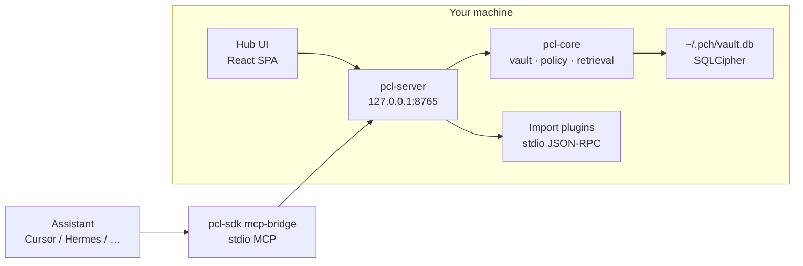
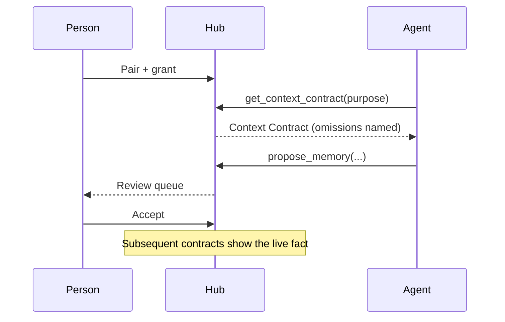

# Architecture

The Hub is a local control plane around an encrypted vault. Policy lives in the kernel. HTTP, plugins, and connectors are guests.

## Packages

| Package | Path | Responsibility |
|---|---|---|
| **pcl-core** | `packages/pcl-core` | Trust kernel: schema, encrypted vault, grants, search, contract assembly, audit. **No network, no HTTP, no plugin host.** |
| **pcl-server** | `packages/pcl-server` | FastAPI on loopback, MCP tool dispatcher, OAuth, plugin host, marketplace, SPA static files |
| **pcl-sdk** | `packages/pcl-sdk` | HTTP client, MCP stdio bridge, plugin kit/runtime, demo agent, eval and Speckit loop CLIs |
| **pcl-pca** | `packages/pca` | Portable Context Archive export/import |
| **personal-context-hub** | `apps/hub-desktop` | `pch` / `personal-context-hub` launcher and pywebview shell |
| **frontend** | `frontend/` | React 19 UI, built into `pcl-server` static assets |
| **plugins** | `plugins/` | Bundled import plugins |

The public kernel façade is `Hub` in `pcl_core.service`.

## Request paths

**You, in the UI.** The SPA calls `/v1/*` with the owner token from `GET /v1/bootstrap`. Owner routes can create projects, accept proposals, issue grants, and export.

**An assistant.** Pairing mints a connection token. The stdio bridge (`pcl-sdk mcp-bridge`) POSTs to `/v1/mcp/tools/{name}` with `PCH_TOKEN` and `PCH_BASE`. Policy runs in `pcl-core` before any object is returned.

**A plugin.** The host starts a child process. The plugin speaks JSON-RPC (`hub.items.upsert`, `hub.http.fetch`, …) and never sees the vault key. HTTPS is allowlisted to hosts declared in `plugin.toml`.

## Trust kernel

Inside `pcl-core`:

- `vault/` — SQLCipher engine, object store, encrypted blobs
- `schema/` — Pydantic models shared by REST, MCP, and plugins
- `policy/` — grant evaluation, classification ceilings, plugin permission diffs
- `retrieval/` — FTS search, project briefs, manifests, `assemble_contract`
- `memory/` — proposal pipeline
- `audit/` — hash-chained ledger (`prev_hash` / `hash`)

`pcl-core` may persist to the local encrypted vault. It must not import `pcl-server`, `pcl-sdk`, or plugin code, and must not open sockets.

## Control plane

`pcl-server` mounts every product router under `/v1`, plus:

- `POST /v1/mcp/tools/{name}` — same tools as MCP stdio
- `GET /v1/mcp/resources?uri=` — profile, brief, connection self, audit
- `GET /health` — `{ "ok": true }`, no auth
- `GET /openapi.json` and `GET /docs` — FastAPI schema and Swagger UI
- `/` — SPA

Non-loopback `--host` is refused (exit 2). CORS is open because the listener is loopback.

## Assistants consume one contract

Every real-use runtime (Cursor, Hermes, OpenClaw, Claude, ChatGPT) is supposed to consume the **same** situation package through the existing bridge. Recipe *text* may differ; the package must not.

## Development loop (contributors)

Feature work follows Speckit under local `specs/<nnn>-<name>/` (gitignored, not published). `/speckit-loop` plus `uv run pcl-sdk loop` is the default driver. Do not implement [VISION.md](VISION.md) or [ROADMAP.md](ROADMAP.md) as features — spawn a child spec from a roadmap epic instead.

See [AGENTS.md](../AGENTS.md) and the [constitution](../.specify/memory/constitution.md).
